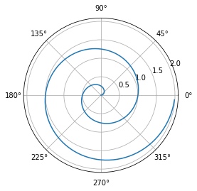

## Polar Axis

For a demonstration of a line plot on a polar axis, see @fig-polar.

::: {#cell-fig-polar .cell execution_count=3}
``` {.python .cell-code}
import numpy as np
import matplotlib.pyplot as plt

r = np.arange(0, 2, 0.01)
theta = 2 * np.pi * r
fig, ax = plt.subplots(
  subplot_kw = {'projection': 'polar'} 
)
ax.plot(theta, r)
ax.set_rticks([0.5, 1, 1.5, 2])
ax.grid(True)
plt.show()
```

::: {.cell-output .cell-output-display}
{#fig-polar}
:::
:::


